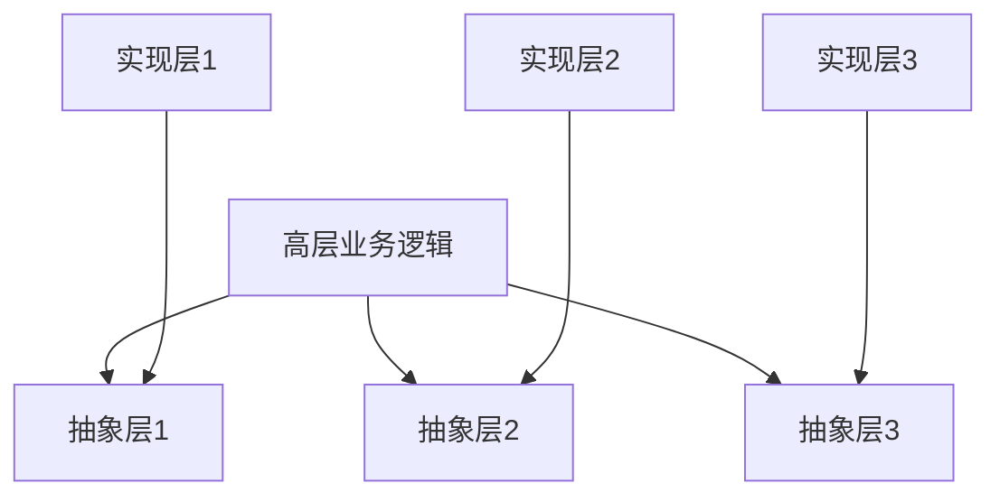
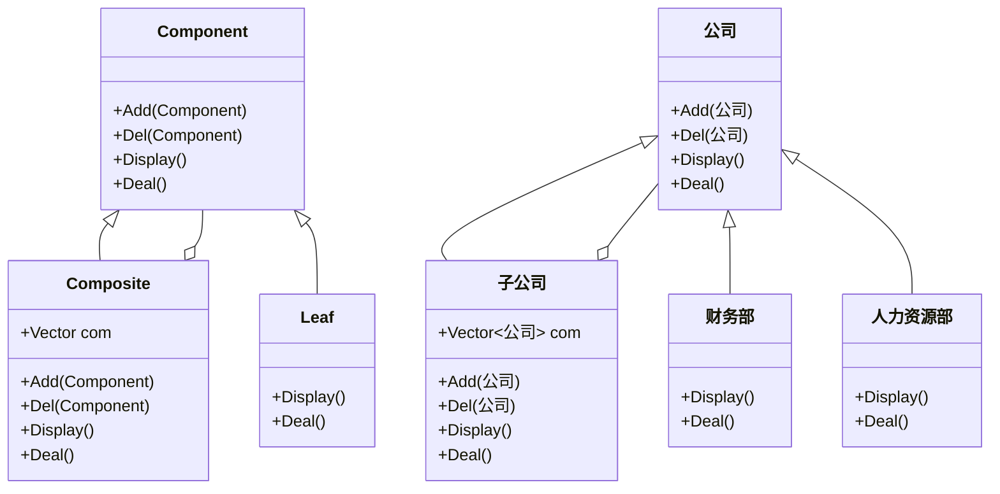
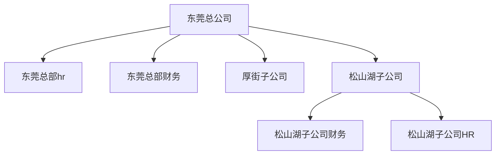
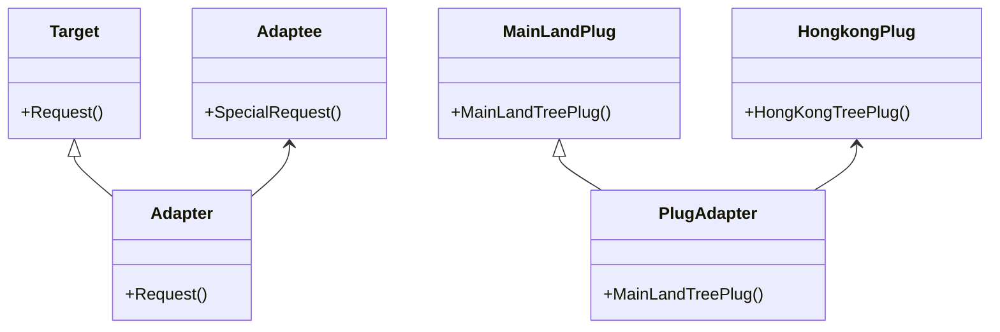
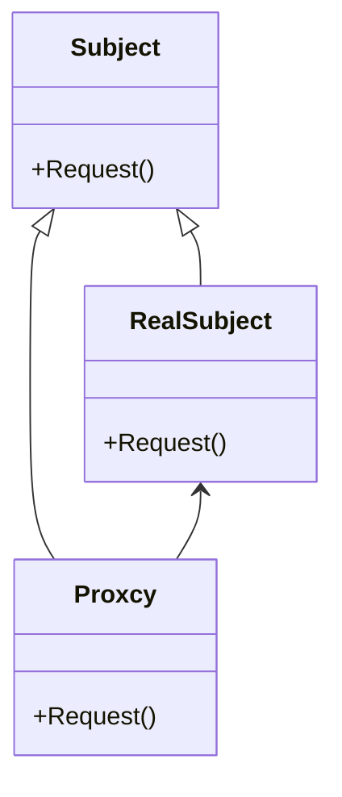
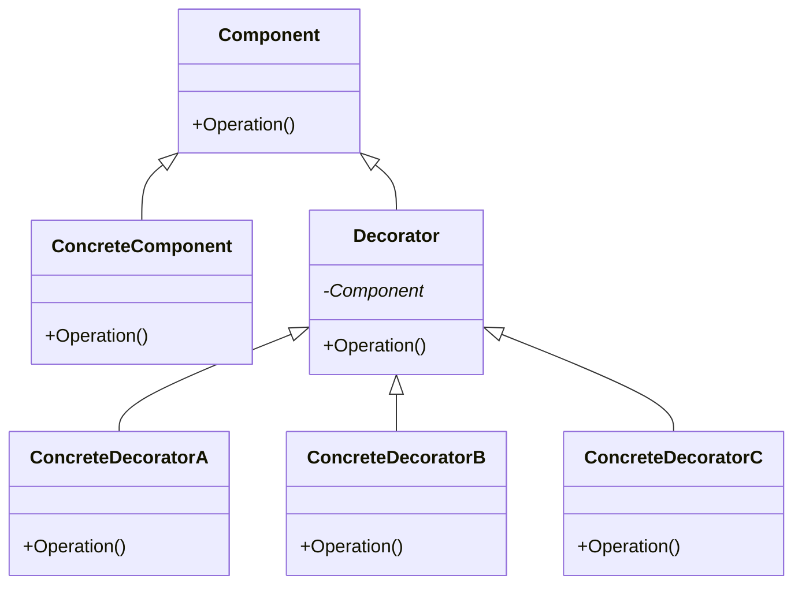
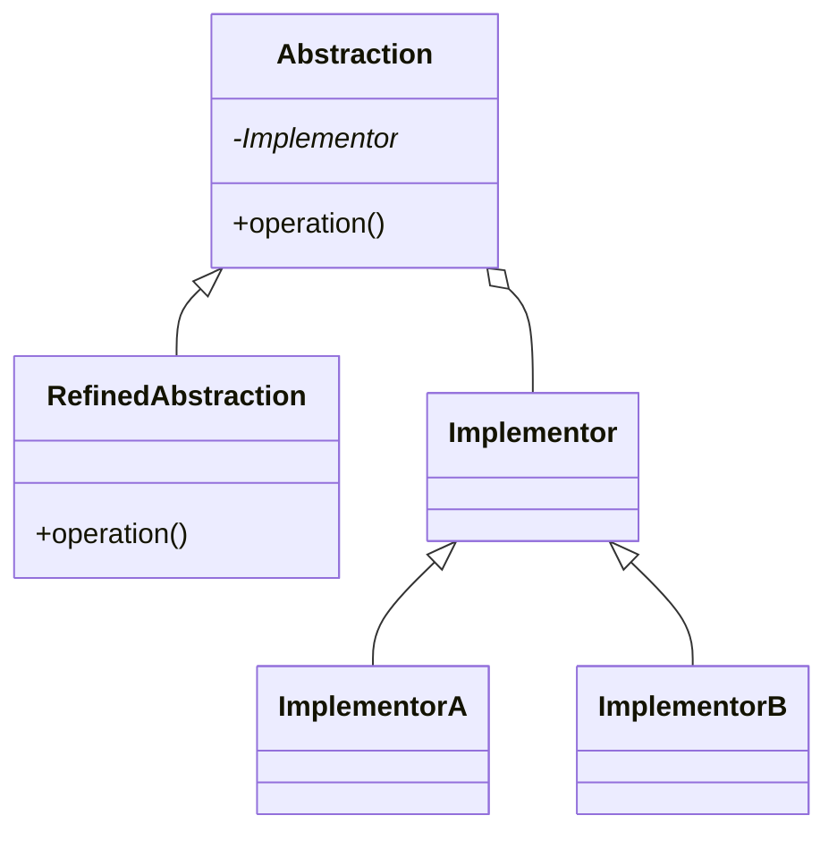
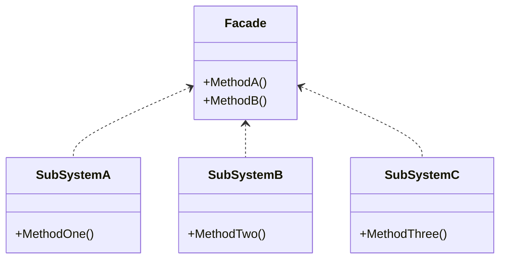

# 设计模式

## 1 基本介绍

​		设计模式（Design pattern） 是解决软件开发某些特定问题而提出的一些解决方案也可以理解成解决问题的一些思路。通过设计模式可以帮助我们增强代码的可重用性、可扩充性、 可维护性、灵活性好。我们使用设计模式最终的目的是实现代码的高内聚和低耦合。

## 2 设计原则

### 2.1 单一职责原则

一个类只负责一件事，内聚；

优点：以降低类的复杂程度、可以提高类的可读性和维护性、降低因为业务修改带来的风险。

### 2.2 开放封闭原则

软件实体(类、模块、函数)对扩张开放，对修改封闭。

### 2.3 依赖倒转原则

依赖于抽象（接口），不依赖于具体的实现（类），也就是针对==接口编程==。

高层模块不应该依赖底层模块，两个都应该依赖抽象。

抽象不应该依赖细节，细节应该依赖抽象。




### 2.4 里氏替换原则

==子类型必须能够替换掉它们的父类型==，一个软件实体如果使用的是一个父类的话，那么一定适用于其子类，而且它察觉不出父类对象和子类对象的区别。也就是说，在软件里面，把**父类都替换成它的子类，程序的行为没有变化**。

**只有当子类可以替换掉父类，软件单元的功能不能受到影响时，父类才能真正被复用，而子类也能够在父类的基础上增加新的功能。**

### 2.5 迪米特法则

又名最小知道原则。

 一个对象应该对其他对象保持最少的了解，类与类关系越密切，耦合度越大。

### 2.6 接口隔离原则

**将臃肿庞大的接口拆分成更小和更具体的接口**。要为各个类建立它们需要的专用接口，而不要试图去建立一个庞大的接口供所有一类它的类去调用。

### 2.7 合成复用原则

​	找出应用中可能需要变化之处，把它们独立出来，不要和那些不需要变化的代码混在一起。

​	针对接口编程，而不是针对实现编程。

​	为了交互对象之间的松耦合设计而努力， 少用继承。

## 3 设计模式的分类


总体来说设计模式分为三大类：

创建型模式，共五种：工厂方法模式、抽象工厂模式、单例模式、建造者模式、原型模式。

结构型模式，共七种：适配器模式、装饰器模式、代理模式、外观模式、桥接模式、组合模式、享元模式。

行为型模式，共十一种：策略模式、模板方法模式、观察者模式、迭代子模式、责任链模式、命令模式、备忘录模式、状态模式、访问者模式、中介者模式、解释器模式。

## 4 创建型


## 5 结构型

### 5.1 组合模式

将对象组合成树形结构以表示“部分与整体”的层次结构。组合模式使得用户对单个对象和组合对象的实际用具有一致性。




​	当你发现需求中体现部分与整体层次的结构时，以及你希望用户可以忽略组合对象与单个对象的不同，统一地使用组合结构中的所有对象时，就应该考虑组合模式了。==组合模式让客户可以一致地使用组合结构和单个对象。==

组合模式主要用来处理树形结构的数据，如果要表达的数据不是树形结构，就不太适合组合模式。

- 样例：



- 代码实现

  ```c++
  /**
  	公司管理系统抽象接口
  */
  #pragma once
  #include <string>
  #include <map>
  #include <memory>
  class Company {
  public:
  	Company(uint32_t id, std::string name) : m_id(id), m_name(name) {}
  	virtual void Add(uint32_t id, std::unique_ptr<Company>&& company) {};
  	virtual void Del(uint32_t id) {};
  	virtual void Display() {};
  	virtual void Doduty() {};
  protected:
  	uint32_t m_id;
  	std::string m_name;
  	//std::map<uint32_t, std::unique_ptr<Company>> m_company;
  };
  ```

  ```c++
  /**
  	xxx子公司
  */
  #pragma once
  #include "Company.h"
  
  class DGCompany : public Company {
  public:
  	DGCompany(uint32_t id, std::string name) : Company(id, name) {}
  	virtual void Add(uint32_t id, std::unique_ptr<Company>&& company);
  	virtual void Del(uint32_t id);
  	virtual void Display();
  	void Doduty();
  private:
  	std::map<uint32_t, std::unique_ptr<Company>> m_company;
  };
  #include "DGCompany.h"
  #include <iostream>
  #include  <utility>
  
  void DGCompany::Add(uint32_t id, std::unique_ptr<Company>&& company)
  {
  	m_company.emplace(std::make_pair(id, std::forward<std::unique_ptr<Company>>(company)));
  }
  
  void DGCompany::Del(uint32_t id)
  {
  	m_company.erase(id);
  }
  
  void DGCompany::Display()
  {
  	std::cout << "Company id : " << m_id << "  name : " << m_name << std::endl;
  	for (auto& company : m_company) {
  		(company.second)->Display();
  	}
  }
  
  void DGCompany::Doduty()
  {
  	std::cout << "DGCompany work ..." << std::endl;
  	for (auto& company : m_company) {
  		(company.second)->Doduty();
  	}
  }
  ```

  ```c++
  /*
  	HR 部门
  */
  #pragma once
  #include "Company.h"
  
  class HrDept : public Company {
  public:
  	HrDept(uint32_t id, std::string name) : Company(id, name) {}
  	void Doduty();
  	void Display();
  };
  #include "HrDept.h"
  #include <iostream>
  
  void HrDept::Doduty()
  {
  	std::cout << "HrDept work ..." << std::endl;
  }
  
  void HrDept::Display()
  {
  	std::cout << "Company id : " << m_id << "  name : " << m_name << std::endl;
  }
  ```

  ```c++
  /**
  	财务部
  */
  #pragma once
  #include "Company.h"
  
  class FinanceDept : public Company {
  public:
  	FinanceDept(uint32_t id, std::string name) : Company(id, name) {}
  	void Display();
  	void Doduty();
  };
  #include "FinanceDept.h"
  #include <iostream>
  
  void FinanceDept::Doduty()
  {
  	std::cout << "FinanceDept work ..." << std::endl;
  }
  
  void FinanceDept::Display()
  {
  	std::cout << "Company id : " << m_id << "  name : " << m_name << std::endl;
  }
  ```

### 5.2 适配器模式

- 概念

适配器模式将一个类的接口转换成客户希望的另外一个接口。Adapter模式使得原本由于接口不兼容而不能一起工作的那些类可以一起工作。

适配器模式主要应用于希望复用一些现存的类，但是接口又与复用环境不一致的情况。

- 类结构图



1. Target:客户所期待的接口，目标可以时具体的或者抽象的类，也可以是接口

2. Adapter:通过在内部包装一个Adaptee对象，把源皆苦转换成目标接口

3. Adaptee：需要适配的类

适配器实现有三大类：类适配器，对象适配器，接口适配器。

1. 类适配器：通过多重继承目标接口和被适配者类方式来实现适配
2. 对象适配器：对象适配器和类适配器使用了不同的方法实现适配，对象适配器使用组合，类适配器使用继承。
3. 接口适配器：当不需要全部实现接口提供的方法时，可先设计一个抽象类实现接口，并为该接口中每个方法提供一个默认实现（空方法），那么该抽象类的子类可有选择地覆盖父类的某些方法来实现需求，它适用于一个接口不想使用其所有的方法的情况。

- 举例 ：使用 对象适配器

插头转换案例，香港的三座插头和大陆的三座插头不同，如果买了香港的电器，需要买相应的转换插头。

```c++
/**
* 
	期望接口 : 大陆插头
*/
#pragma once

class MainLandPlug {
public:
	virtual void MainLandTreePlug() = 0; // 大陆三座插头
};

/**
	插头转换适配器
*/
#pragma once
#include "MainLandPlug.h"
#include <memory>
#include "HongkongPlug.h"
class PlugAdapter : public MainLandPlug {
public:
	PlugAdapter();
	virtual ~PlugAdapter() = default;
	void MainLandTreePlug();
private:
	std::unique_ptr<HongkongPlug> m_adpter{ nullptr };
};

/**
	需要适配的类：香港插头
*/
#pragma once
class HongkongPlug {
public:
	void HongkongTreePlug();
};
```

```c++
void HongkongPlug::HongkongTreePlug()
{
	std::cout << "香港三座插头" << std::endl;
}

PlugAdapter::PlugAdapter()
{
	m_adpter = std::make_unique<HongkongPlug>();
}

void PlugAdapter::MainLandTreePlug()
{
	if (m_adpter == nullptr) {
		std::cout << "adpter is nullptr ... " << std::endl;
		return;
	}
	m_adpter->HongkongTreePlug();
}

int main() {
	auto ptr = std::make_unique<PlugAdapter>();
	ptr->MainLandTreePlug();
	return 0;
}
```

### 5.3 代理模式

- 概念

代理模式为其他对象提供一个代理以控制对这个对象的访问。

- 结构图



- 角色介绍

Subject:（抽象主题类）：该类的主要职责是声明真实主题与代理的共同接口方法，该类既可以是一个抽象类也可以是一个接口。

RealSubject:（真实主题类）：该类也称为被委托类或被代理类，该类定义了代理所表示的真实对象，由其执行具体的业务逻辑方法，而客户类则通过代理类间接地调用真实主题中定义的方法。

Proxy（代理类）：该类也称为委托类或代理类，该类持有一个对真实主题类的引用，在其所实现的接口方法中调用真实主题类中相应的接口方法执行，以此起到代理的作用。

Client:（客户类）：即使用代理类的类型。

- 应用

1. 远程代理：为一个对象在不同的地址空间提供局部的代表，这样可以隐藏一个对象存在于不同地址空间的的事实。如：web应用。

2. 虚拟代理：根据需要创建开销很大的对象。通过它来存放实例化需要很长时间的真实对象。如：网页。

3. 安全代理：用来控制真实对象的访问权限。
4. 智能指针：当调用真实的对象时，代理处理另外一些事情。如：引用计数。

- 举例

小明给女朋友小红女神节送花，但和小红不在一个城市，于是网上订了花叫跑腿帮忙送过去。此例：主题是送花，代理类是外卖员。实际主题是小明。

```c++
/**
	代理模式：主题，代理类和实际执行类共有的接口，都需继承此类
*/
#pragma once

class Subject {
public:
	virtual void SendFlower() = 0;
};
/**
	代理类：外卖员
*/
#pragma once
#include "Subject.h"
#include "RealSubject.h"
class ProxyClass : public Subject {
public:
	ProxyClass();
	virtual ~ProxyClass();
	void SendFlower();
private:
	Subject* m_subject;
};
/**
	实际操作者
*/
#pragma once
#include "Subject.h"
class RealSubject : public Subject {
public:
	void SendFlower();
};
```

```c++
#include "ProxyClass.h"

ProxyClass::ProxyClass()
{
	m_subject = new RealSubject();
}

ProxyClass::~ProxyClass()
{
	if (m_subject != nullptr) {
		delete m_subject;
		m_subject = nullptr;
	}
}
void ProxyClass::SendFlower()
{
	if (m_subject == nullptr) {
		return;
	}
	m_subject->SendFlower();
}

#include "RealSubject.h"
#include <iostream>

void RealSubject::SendFlower()
{
	std::cout << "小明买花送给女朋友小红" << std::endl;
}

int main() {
	auto proxy = make_unique<ProxyClass>();
	proxy->SendFlower();
	return 0;
}
```

### 5.4 装饰模式

- 概念

装饰模式：动态地给一个对象添加一些额外的职责，就增加功能来说，装饰模式比生成子类更加灵活。又叫做包装模式。通过一种对客户端透明的方式来扩展对象的功能，是继承关系的一个替换方案。装饰模式就是把要添加的附加功能分别放在单独的类中，并让这个类包含它要装饰的对象，当需要执行时，客户端就可以有选择地、按顺序地使用装饰功能包装对象。

- 结构图



Component:定义一个对象接口。可以给这些对象动态地添加职责。

Decorator:装饰抽象类，继承了Component,从外类来扩展Component类的功能，但对于Component来说，是无需知道Decorator的存在的。

ConcreteComponent:定义了一个具体的对象，也可以给这个对象添加一些职责。(主体：被装饰者)

ConcreteDecoratorA:具体的装饰对象，提到给Component添加职责的功能。（饰品：装饰）

- 优秀博客

https://blog.csdn.net/qq_51340322/article/details/126396648

- 样例

产品升级

```c++
/**
	升级构件
*/
#pragma once

class Component {
public:
	virtual void Upgrade() = 0;
};
/**
	第一版设备升级
*/
#pragma once
#include "Component.h"

class ConcreteComponent : public Component {
public:
	void Upgrade();
};
/**
	升级装饰抽象类
*/
#pragma once
#include "Component.h"
class Decorator : public Component {
public:
	Decorator(Component* com) : m_component(com) {}
	//void Upgrade();
protected:
	Component* m_component;  // 需要被装饰的对象
};
/**
	设备A升级装饰
*/
#pragma once
#include "Decorator.h"
class DeviceAUpgrade : public Decorator {
public:
	DeviceAUpgrade(Component* com) : Decorator(com) {}
	void Upgrade();
};

```

```c++
#include "ConcreteComponent.h"
#include <iostream>
void ConcreteComponent::Upgrade()
{
	std::cout << "基础版本升级。。。" << std::endl;
}

#include "DeviceAUpgrade.h"
#include <iostream>
void DeviceAUpgrade::Upgrade()
{
	if (m_component == nullptr) {
		return;
	}
	m_component->Upgrade();
	std::cout << "补丁1， 修复。。。" << std::endl;
}

int main() {
	// 设备初始版本v1.0
	ConcreteComponent* com = new ConcreteComponent();
	// 修复补丁版本v2.0
	DeviceAUpgrade* grade = new DeviceAUpgrade(com);
	grade->Upgrade();
	delete grade;
	delete com;
	return 0;
}
```

### 5.5 桥接模式

- 概念

​    桥接模式将抽象部分与它的实现部分分离，使它们都可以独立地变化。实现系统可能有多角度分类，每一种分类都有可能变化，那么就把这种多角度分离出来让它们独立变化，减少它们之间的耦合。

- 结构图



1. Abstraction（抽象类）: 用于定义抽象类的接口，其中定义了一个Implementation（实现类接口）的对象并可以维护该对象，它与 Implementation具有关联关系。
2. Refined Abstraction（扩充抽象类）: 扩充由Abstraction定义的接口，通常它不再是抽象类而是具体类。提供控制逻辑的变体。与其父类一样，它们通过通用实现接口与不同的实现进行交互提供高层控制逻辑，依赖于完成底层实际工作的实现对像
3. Implementation（实现类接口）: 为所有具体实现声明通用接口。抽象部分仅能通过在这里声明的方法与实现对象交互.
4. ConcreateImplementations（具体实现类）: 包括特定的实现代码.
5. Client（客户端）: 仅关心如何与抽象部分合作。但是，Client需要将抽象对象与一个实现对象连接起来。

- 样例

​    手机品牌和手机软件两个用聚合的方式实现分离，解耦，避免继承关系过于庞大。

```c++
/**
	独立变化一：手机品牌接口类
*/
#pragma once
#include <vector>
#include "PhoneSoft.h"
class PhoneBrand {
public:
	inline void AddPhoneSoft(PhoneSoft* soft)
	{
		m_phoneSoft.push_back(soft);
	}
	virtual void Run() = 0;
protected:
	std::vector<PhoneSoft*> m_phoneSoft;
};
/**
	HW 手机品牌
*/
#pragma once
#include "PhoneBrand.h"
class HwPhoneBrand : public PhoneBrand {
public:
	void Run();
};
/**
	独立变化二：手机软件接口类
*/
#pragma once

class PhoneSoft {
public:
	virtual void Run() = 0;
};
/**
	PhoneGame：作为手机软件的一个具体实现类
*/
#pragma once
#include "PhoneSoft.h"
class PhoneGame : public PhoneSoft {
public:
	void Run();
};
/**
	PhoneCarame：拍照作为手机软件的一个具体实现类
*/
#pragma once
#include "PhoneSoft.h"
class PhoneCarame : public PhoneSoft {
public:
	void Run();
};
```

```c++
#include "HwPhoneBrand.h"
#include <iostream>

void HwPhoneBrand::Run()
{
	std::cout << "run hw phone ..." << std::endl;
	for (auto soft : m_phoneSoft) {
		soft->Run();
	}
}
#include "PhoneCarame.h"
#include <iostream>

void PhoneCarame::Run()
{
	std::cout << "Run PhoneCarame ..." << std::endl;
}
#include "PhoneGame.h"
#include <iostream>

void PhoneGame::Run()
{
	std::cout << "run game ..." << std::endl;
}
// 测试
int main() {
	// 创建hw品牌手机实例
	HwPhoneBrand* hwBrand = new HwPhoneBrand();
	// 聚合两个实现
	// 手机游戏
	PhoneGame* game = new PhoneGame();
	// 手机相机
	PhoneCarame* carame = new PhoneCarame();
	hwBrand->AddPhoneSoft(game);
	hwBrand->AddPhoneSoft(carame);
	hwBrand->Run();
	delete hwBrand;
	delete game;
	delete carame;
	return 0;
}
```

### 5.6 外观模式

- 概念

​    外观模式为子系统中的一组接口提供一个一致的界面，此模式定义了一个高层接口，这个接口使得这一子系统更加容易使用。

​	主要解决： 降低访问复杂系统的内部子系统时的复杂度，简化客户端之间的接口。

​	何时使用： 1、客户端不需要知道系统内部的复杂联系，整个系统只需提供一个"接待员"即可。 2、定义系统的入口。

​	优点： 1、减少系统相互依赖。 2、提高灵活性。 3、提高了安全性。

​    缺点：不符合开闭原则，如果要改东西很麻烦，继承重写都不合适。

​	使用场景： 1、为复杂的模块或子系统提供外界访问的模块。 2、子系统相对独立。 3、预防低水平人员带来的风险。

​	注意事项： 在层次化结构中，可以使用外观模式定义系统中每一层的入口。


- 用例图



Facade：外观类，知道哪些子系统类负责处理请求，将客户的请求代理给适当的子系统对象。

SubSystem Class：子系统类集合，实现子系统的功能，处理Facade对象指派的任务。注意子类中没有Facade的任何信息，即没有对Facade对象的引用。

- 样例

​    去医院看病，可能要去挂号、门诊、划价、取药，让患者或患者家属觉得很复杂，如果有提供接待人员，只让接待人员来处理，就很方便

```c++
/**
	门面模式对外接口
	医院接待员，用来处理 挂号、门诊、划价、取药 等一系列动作。
*/
#pragma once
#include <memory>
#include "PayMoney.h"
#include "RegisterOrder.h"
#include "Doctor.h"

class Receptionist {
public:
	Receptionist();
	virtual ~Receptionist() = default;
	void DoWork();  // 完成子系统一系列操作的封装
private:
	std::unique_ptr<PayMoney> m_paySys;
	std::unique_ptr<RegisterOrder> m_regSys;
	std::unique_ptr<Doctor> m_docSys;
};

/**
	子系统之挂号
*/
#pragma once

class RegisterOrder {
public:
	void RegisterHospital();
};

/**
	门面模式子系统之 门诊医生
*/
#pragma once

class Doctor {
public:
	void DoCheck();
};

/**
	门面模式之交钱系统
*/
#pragma once

class PayMoney {
public:
	void ClearAccouns();
};
```

```c++
#include "Receptionist.h"

Receptionist::Receptionist()
{
	m_docSys = std::make_unique<Doctor>();
	m_paySys = std::make_unique<PayMoney>();
	m_regSys = std::make_unique<RegisterOrder>();
}


void Receptionist::DoWork()
{
	if (m_docSys == nullptr || m_paySys == nullptr || m_regSys == nullptr) {
		return;
	}
	// 先挂号 再去找医生诊断 去结账。。。等乱七八糟的动作封装起来
	m_regSys->RegisterHospital();
	m_docSys->DoCheck();
	m_paySys->ClearAccouns();
}

#include "RegisterOrder.h"
#include <iostream>

void RegisterOrder::RegisterHospital()
{
	std::cout << "挂号看病..." << std::endl;
}

#include "Doctor.h"
#include <iostream>

void Doctor::DoCheck()
{
	std::cout << "医生检查..." << std::endl;
}

#include "PayMoney.h"
#include <iostream>

void PayMoney::ClearAccouns()
{
	std::cout << "结清账单，去做相关检查和取药。。。" << std::endl;
}
// 测试
int main() {
	Receptionist receptionist;
	receptionist.DoWork();
	return 0;
}
```


## 6 行为型

