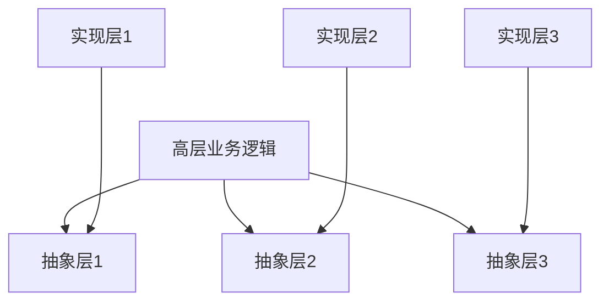
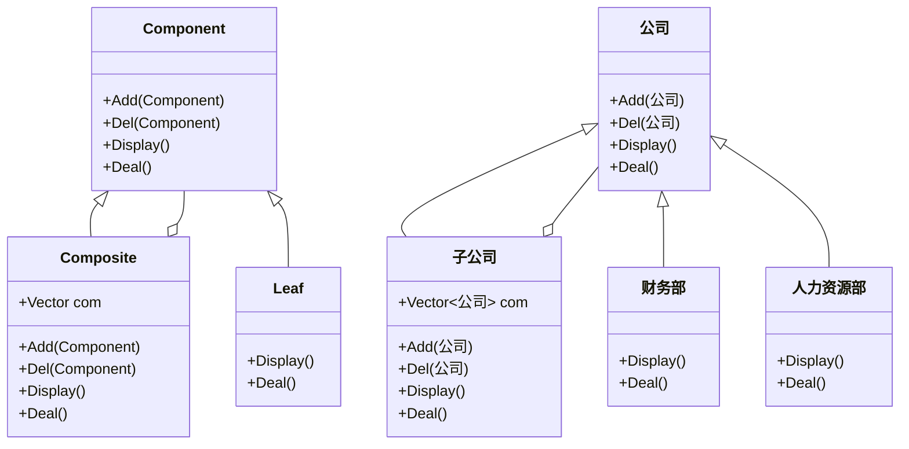
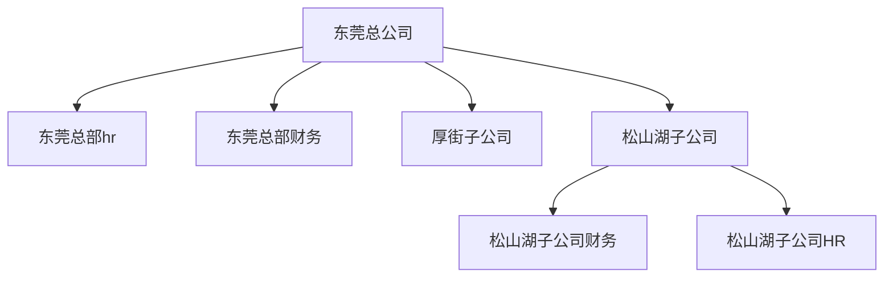

# 设计模式

## 1 基本介绍

​		设计模式（Design pattern） 是解决软件开发某些特定问题而提出的一些解决方案也可以理解成解决问题的一些思路。通过设计模式可以帮助我们增强代码的可重用性、可扩充性、 可维护性、灵活性好。我们使用设计模式最终的目的是实现代码的高内聚和低耦合。

## 2 设计原则

### 2.1 单一职责原则

一个类只负责一件事，内聚；

优点：以降低类的复杂程度、可以提高类的可读性和维护性、降低因为业务修改带来的风险。

### 2.2 开放封闭原则

软件实体(类、模块、函数)对扩张开放，对修改封闭。

### 2.3 依赖倒转原则

依赖于抽象（接口），不依赖于具体的实现（类），也就是针对==接口编程==。

高层模块不应该依赖底层模块，两个都应该依赖抽象。

抽象不应该依赖细节，细节应该依赖抽象。

### 2.4 里氏替换原则

==子类型必须能够替换掉它们的父类型==，一个软件实体如果使用的是一个父类的话，那么一定适用于其子类，而且它察觉不出父类对象和子类对象的区别。也就是说，在软件里面，把**父类都替换成它的子类，程序的行为没有变化**。

**只有当子类可以替换掉父类，软件单元的功能不能受到影响时，父类才能真正被复用，而子类也能够在父类的基础上增加新的功能。**

### 2.5 迪米特法则

又名最小知道原则。

 一个对象应该对其他对象保持最少的了解，类与类关系越密切，耦合度越大。

### 2.6 接口隔离原则

**将臃肿庞大的接口拆分成更小和更具体的接口**。要为各个类建立它们需要的专用接口，而不要试图去建立一个庞大的接口供所有一类它的类去调用。

### 2.7 合成复用原则

​	找出应用中可能需要变化之处，把它们独立出来，不要和那些不需要变化的代码混在一起。

​	针对接口编程，而不是针对实现编程。

​	为了交互对象之间的松耦合设计而努力， 少用继承。

## 3 设计模式的分类

总体来说设计模式分为三大类：

创建型模式，共五种：工厂方法模式、抽象工厂模式、单例模式、建造者模式、原型模式。

结构型模式，共七种：适配器模式、装饰器模式、代理模式、外观模式、桥接模式、组合模式、享元模式。

行为型模式，共十一种：策略模式、模板方法模式、观察者模式、迭代子模式、责任链模式、命令模式、备忘录模式、状态模式、访问者模式、中介者模式、解释器模式。

## 4 创建型

## 5 结构型

### 5.1 组合模式

将对象组合成树形结构以表示“部分与整体”的层次结构。组合模式使得用户对单个对象和组合对象的实际用具有一致性。

​	当你发现需求中体现部分与整体层次的结构时，以及你希望用户可以忽略组合对象与单个对象的不同，统一地使用组合结构中的所有对象时，就应该考虑组合模式了。==组合模式让客户可以一致地使用组合结构和单个对象。==

组合模式主要用来处理树形结构的数据，如果要表达的数据不是树形结构，就不太适合组合模式。

- 样例：

- 代码实现见github

## 6 行为型

